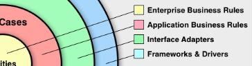

[実装クリーンアーキテクチャ](https://qiita.com/nrslib/items/a5f902c4defc83bd46b8)

# Enterprise Business Rules

黄色のレイヤーの `Enterprise Business Rules` はビジネスロジックを表現するオブジェクトが所属するレイヤー。
`トランザクションスクリプト`や`ドメイン駆動設計でいうところのエンティティ`などはここに所属する。

**このレイヤーは最も大事**なものになる。

# Application Business Rules
赤いレイヤーは `Application Business Rules` になる。
このレイヤーは`「ソフトウェアが何ができるのか」`を表現します。
`Enterprise Business Rules に所属するオブジェクトを協調させ、ユースケースを達成`する。

ドメイン駆動設計でいうところの`アプリケーションサービス`なんかはここに所属する。

# Interface Adapters

緑色のレイヤーは `Interface Adapters` で`入力、永続化、表示`を担当するオブジェクトが所属する。
入力とは `Application Business Rules` に伝えるためのデータ加工を指す。
永続化とはデータの保存を指し、表示は結果の表示になる。

一般的な `MVC フレームワーク`や`単体テストクラス`などはこのレイヤーに所属する。

# Frameworks & Drivers
`Web フレームワーク`や`データベース操作オブジェクト`などの`技術的なコード`がここに所属する。
フロントエンドの `UI` などもここに所属しています。

